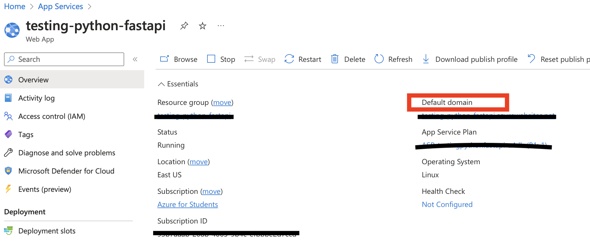

# Media Sharing App

1. Create a [Python virtual environment](https://docs.python.org/3/tutorial/venv.html#creating-virtual-environments) and activate it.

2. Install the requirements:

    ```shell
    python3 -m pip install -r requirements.txt
    ```

### Deployment
1. Set up web app through</br>
```shell
az webapp up --name <app_name> --location <region> --runtime PYTHON:3.11 --sku B1 --logs
```

or Manually create web app through Azure portal
2. Deploy to web app

First, get default domain

Then use terminal and locate to 
```shell
git remote add azure <yourpath>
git push azure main:master
```

### Testing in Azure

Once deployed, test different paths on the deployed URL, using either a browser or a tool like Postman.

```
http://<FunctionAppName>.azurewebsites.net/sample
http://<FunctionAppName>.azurewebsites.net/hello/Foo
```
